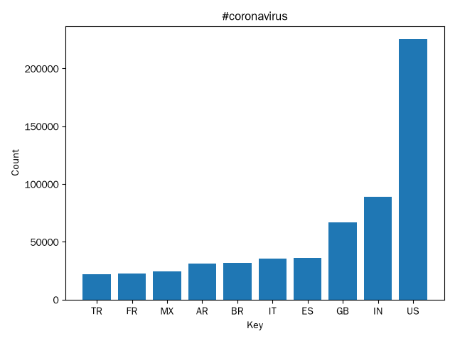
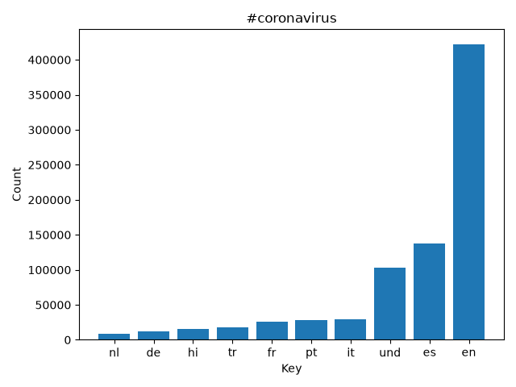
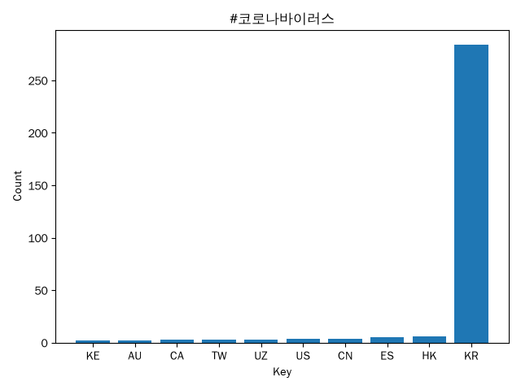
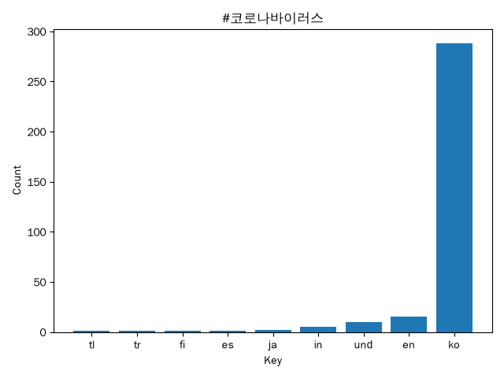
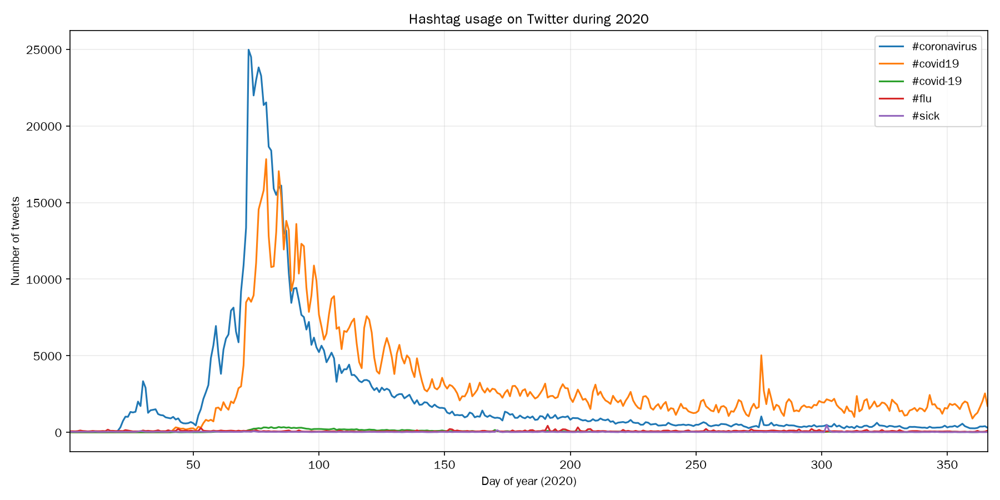

# Twitter Coronavirus MapReduce Analysis

This project analyzes approximately 1.1 billion geotagged tweets from 2020 using a MapReduce-style workflow on a Unix server. The goal is to measure how coronavirus-related hashtags varied across languages, countries, and time while practicing parallel processing on a dataset too large to analyze efficiently with a single sequential process.

## Approach

The analysis uses a three-stage workflow:

1. **Map:** Each day of Twitter data is processed independently with `src/map.py`. The mapper counts selected hashtags by both tweet language and country.
2. **Reduce:** `src/reduce.py` combines the daily mapper outputs into aggregate country- and language-level counts.
3. **Visualize:** `src/visualize.py` displays the ten most frequent countries or languages for selected hashtags.

The mapper jobs for all 366 days of 2020 are launched in parallel using `run_maps.sh`, which uses Unix process-control tools including `nohup`, background processes (`&`), and file globbing.

## Coronavirus Hashtag Results

### `#coronavirus` by Country

### `#coronavirus` by Language

### `#코로나바이러스` by Country

### `#코로나바이러스` by Language

## Hashtag Usage Over Time

I also implemented an alternative reducer that preserves the daily dimension of the mapper outputs rather than collapsing all 366 days into one annual total.

The time-series analysis compares raw daily usage of five hashtags:

- `#coronavirus`
- `#covid19`
- `#covid-19`
- `#flu`
- `#sick`

This visualization makes it possible to compare the emergence of COVID-specific terminology with broader pre-existing illness-related hashtags over the course of 2020.

## Implementation

The primary components are:

- `src/map.py` — processes one daily Twitter archive and produces language- and country-level hashtag counts
- `src/reduce.py` — aggregates daily mapper outputs into full-year totals
- `src/visualize.py` — generates ranked bar charts from reduced results
- `src/alternative_reduce.py` — constructs daily hashtag time series and generates a multi-line plot
- `run_maps.sh` — launches the 366 daily mapping jobs in parallel

The project demonstrates parallel data processing, Unix process management, JSON parsing, defensive handling of incomplete geographic metadata, multilingual text processing, and visualization of large-scale social-media data.
